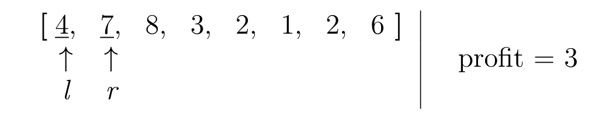

# LeetCode 121: Best Time to Buy and Sell Stock

[Problem statement on LeetCode](https://leetcode.com/problems/best-time-to-buy-and-sell-stock/)

## Approach

We will find the maximum profit using the sliding window technique. A sliding window technique uses 2 pointers which move along the array at varying speeds and both pointers make a sub-array with elements between the two pointers. In order to get the maximum profit, we need to buy at the lowest price and sell at the highest. We will use the left pointer to point to the minimum price and the right to go through the array. If a new lower price is found by the right pointer, the left pointer will be shifted to the position of the right pointer. Otherwise, it would mean that the price at the right pointer is larger than the price at the left, which will generate a profit. However, we need a variable to keep track of the maximum profit we have calculated thus far to prevent a lower profit from overriding the maximum and ensure that we will maximize our profits. 

$$
\large
\begin{array}{ccccccccccc|}
\textbf{[} \mkern-5mm & \underline{4}, & \underline{7}, & 8, & 3, & 2, & 1, & 2, & 6 & \mkern-5mm \textbf{]} & \\
& \uparrow & \uparrow & & & & & & & & \\
& \textit{l} & \textit{r} & & & & & & & & 
\end{array}
\quad \text{profit = 3}
$$

$$
\large
\begin{array}{ccccccccccc|}
\textbf{[}\mkern-5mm & \underline{4}, & 7, & \underline{8}, & 3, & 2, & 1, & 2, & 6 & \mkern-5mm \textbf{]} & \\
& \uparrow & & \uparrow & & & & & & & \\
& \textit{l} & & \textit{r} & & & & & & & 
\end{array}
\quad \text{profit = 4}
$$

$$
\large
\begin{array}{ccccccccccc|}
\textbf{[}\mkern-5mm & \underline{4}, & 7, & 8, & \underline{3}, & 2, & 1, & 2, & 6 & \mkern-5mm \textbf{]} & \\
& \uparrow & & & \uparrow & & & & & & \\
& \textit{l} & & & \textit{r} & & & & & & 
\end{array}
\quad \text{profit = 4}
$$

$$
\large
\begin{array}{ccccccccccc|}
\textbf{[}\mkern-5mm & 4, & 7, & 8, & \underline{3}, & 2, & 1, & 2, & 6 & \mkern-5mm \textbf{]} & \\
& & & & \uparrow & & & & & & \\
& & & & \textit{l, r} & & & & & & 
\end{array}
\quad \text{profit = 4}
$$

$$
\large
\begin{array}{ccccccccccc|}
\textbf{[}\mkern-5mm & 4, & 7, & 8, & \underline{3}, & \underline{2}, & 1, & 2, & 6 & \mkern-5mm \textbf{]} & \\
& & & & \uparrow & \uparrow & & & & & \\
& & & & \textit{l} & \textit{r} & & & & & 
\end{array}
\quad \text{profit = 4}
$$

$$
\large
\begin{array}{ccccccccccc|}
\textbf{[}\mkern-5mm & 4, & 7, & 8, & 3, & \underline{2}, & 1, & 2, & 6 & \mkern-5mm \textbf{]} & \\
& & & & & \uparrow & & & & & \\
& & & & & \textit{l, r} & & & & & 
\end{array}
\quad \text{profit = 4}
$$

$$
\large
\begin{array}{ccccccccccc|}
\textbf{[}\mkern-5mm & 4, & 7, & 8, & 3, & \underline{2}, & \underline{1}, & 2, & 6 & \mkern-5mm \textbf{]} & \\
& & & & & \uparrow & \uparrow & & & & \\
& & & & & \textit{l} & \textit{r} & & & & 
\end{array}
\quad \text{profit = 4}
$$

$$
\large
\begin{array}{ccccccccccc|}
\textbf{[}\mkern-5mm & 4, & 7, & 8, & 3, & 2, & \underline{1}, & 2, & 6 & \mkern-5mm \textbf{]} & \\
& & & & & & \uparrow & & & & \\
& & & & & & \textit{l, r} & & & & 
\end{array}
\quad \text{profit = 4}
$$

$$
\large
\begin{array}{ccccccccccc|}
\textbf{[}\mkern-5mm & 4, & 7, & 8, & 3, & 2, & \underline{1}, & \underline{2}, & 6 & \mkern-5mm \textbf{]} & \\
& & & & & & \uparrow & \uparrow & & & \\
& & & & & & \textit{l} & \textit{r} & & & 
\end{array}
\quad \text{profit = 4}
$$

$$
\large
\begin{array}{ccccccccccc|}
\textbf{[}\mkern-5mm & 4, & 7, & 8, & 3, & 2, & \underline{1}, & 2, & \underline{6} & \mkern-5mm \textbf{]} & \\
& & & & & & \uparrow & & \uparrow & & \\
& & & & & & \textit{l} & & \textit{r} & & 
\end{array}
\quad \text{profit = 5}
$$

## Example 1:

Let the prices array be

## Example 2:

## Possible Considerations
