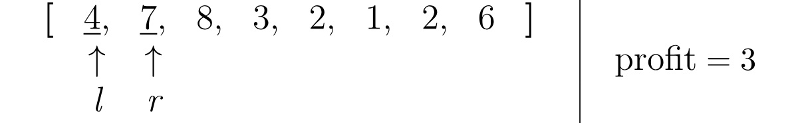

# LeetCode 121: Best Time to Buy and Sell Stock
[Problem statement on LeetCode](https://leetcode.com/problems/best-time-to-buy-and-sell-stock/)

**Author:** Yuan Jie Wong  
**Last Updated:** 2025-06-05

## Approach

We will find the maximum profit using the sliding window technique. A sliding window technique uses 2 pointers which move along the array at varying speeds and both pointers make a sub-array with elements between the two pointers. In order to get the maximum profit, we need to buy at the lowest price and sell at the highest. We will use the left pointer to point to the minimum price and the right to go through the array. If a new lower price is found by the right pointer, the left pointer will be shifted to the position of the right pointer. Otherwise, it would mean that the price at the right pointer is larger than the price at the left, which will generate a profit. However, we need a variable to keep track of the maximum profit we have calculated thus far to prevent a lower profit from overriding the maximum and ensure that we will maximize our profits. Only a new larger profit will override the previous saved profit. 

### Key Points:
- left pointer, $l$, will always point to the element with the lowest value among the elements visited by the right pointer, $r$.
- right pointer, $r$, will traverse the array through each element, updating the profit or left pointer when appropriate.

## Example 1:

Let the prices array be `[3, 7, 1, 9]`

$$
\large
\begin{array}{ccccccc|}
\textbf{[} & \underline{3}, & \underline{7}, & 1, & 9 & \textbf{]} & \\
& \uparrow & \uparrow & & & & \\
& \textit{l} & \textit{r} & & & & 
\end{array}
\quad \text{profit} = 4
$$

> The right pointer will iterate through the array, stopping at each element to calculate the profit at a particular element if the element pointed to by $r$ is larger than the lowest price pointed to by the left pointer, $l$. 

$$
\large
\begin{array}{ccccccc|}
\textbf{[} & \underline{3}, & 7, & \underline{1}, & 9 & \textbf{]} & \\
& \uparrow & & \uparrow & & & \\
& \textit{l} & & \textit{r} & & & 
\end{array}
\quad \text{profit} = 4
$$

> If the number pointed to by the right pointer, $r$, is smaller than the number pointed to by the left pointer, $l$, the left pointer needs to be updated to keep  pointing at the smallest number in the array of prices.

$$
\large
\begin{array}{ccccccc|}
\textbf{[} & 3, & 7, & \underline{1}, & 9 & \textbf{]} & \\
& & & \uparrow & & & \\
& & & \textit{l, r} & & & 
\end{array}
\quad \text{profit} = 4
$$

> The left pointer, $l$, is now pointing at the lowest price that is visited by the right pointer.

$$
\large
\begin{array}{ccccccc|}
\textbf{[} & 3, & 7, & \underline{1}, & \underline{9} & \textbf{]} & \\
& & & \uparrow & \uparrow & & \\
& & & \textit{l} & \textit{r} & & 
\end{array}
\quad \text{profit} = 8
$$

Thus, the **maximum profit** to be had here is **8**. Below is a GIF to help visualize the movement of the pointers.


## Example 2:

Let the prices array be `[4, 7, 8, 3, 2, 1, 2, 6]`

$$
\large
\begin{array}{ccccccccccc|}
\textbf{[} & \underline{4}, & \underline{7}, & 8, & 3, & 2, & 1, & 2, & 6 & \textbf{]} & \\
& \uparrow & \uparrow & & & & & & & & \\
& \textit{l} & \textit{r} & & & & & & & & 
\end{array}
\quad \text{profit} = 3
$$

$$
\large
\begin{array}{ccccccccccc|}
\textbf{[} & \underline{4}, & 7, & \underline{8}, & 3, & 2, & 1, & 2, & 6 & \textbf{]} & \\
& \uparrow & & \uparrow & & & & & & & \\
& \textit{l} & & \textit{r} & & & & & & & 
\end{array}
\quad \text{profit} = 4
$$

> The profit variable updates everytime a larger profit can be generated.

$$
\large
\begin{array}{ccccccccccc|}
\textbf{[} & \underline{4}, & 7, & 8, & \underline{3}, & 2, & 1, & 2, & 6 & \textbf{]} & \\
& \uparrow & & & \uparrow & & & & & & \\
& \textit{l} & & & \textit{r} & & & & & & 
\end{array}
\quad \text{profit} = 4
$$

$$
\large
\begin{array}{ccccccccccc|}
\textbf{[} & 4, & 7, & 8, & \underline{3}, & 2, & 1, & 2, & 6 & \textbf{]} & \\
& & & & \uparrow & & & & & & \\
& & & & \textit{l, r} & & & & & & 
\end{array}
\quad \text{profit} = 4
$$

> A new lower price is found, so the left pointer, $l$, is moved to the position of the right pointer, $r$.

$$
\large
\begin{array}{ccccccccccc|}
\textbf{[} & 4, & 7, & 8, & \underline{3}, & \underline{2}, & 1, & 2, & 6 & \textbf{]} & \\
& & & & \uparrow & \uparrow & & & & & \\
& & & & \textit{l} & \textit{r} & & & & & 
\end{array}
\quad \text{profit} = 4
$$

$$
\large
\begin{array}{ccccccccccc|}
\textbf{[} & 4, & 7, & 8, & 3, & \underline{2}, & 1, & 2, & 6 & \textbf{]} & \\
& & & & & \uparrow & & & & & \\
& & & & & \textit{l, r} & & & & & 
\end{array}
\quad \text{profit} = 4
$$

> A new lower value is found again, so the left pointer, $l$, is moved to the position of the right pointer, $r$.

$$
\large
\begin{array}{ccccccccccc|}
\textbf{[} & 4, & 7, & 8, & 3, & \underline{2}, & \underline{1}, & 2, & 6 & \textbf{]} & \\
& & & & & \uparrow & \uparrow & & & & \\
& & & & & \textit{l} & \textit{r} & & & & 
\end{array}
\quad \text{profit} = 4
$$

$$
\large
\begin{array}{ccccccccccc|}
\textbf{[} & 4, & 7, & 8, & 3, & 2, & \underline{1}, & 2, & 6 & \textbf{]} & \\
& & & & & & \uparrow & & & & \\
& & & & & & \textit{l, r} & & & & 
\end{array}
\quad \text{profit} = 4
$$

> Left pointer is moved again because 1 is smaller than 2.

$$
\large
\begin{array}{ccccccccccc|}
\textbf{[} & 4, & 7, & 8, & 3, & 2, & \underline{1}, & \underline{2}, & 6 & \textbf{]} & \\
& & & & & & \uparrow & \uparrow & & & \\
& & & & & & \textit{l} & \textit{r} & & & 
\end{array}
\quad \text{profit} = 4
$$

$$
\large
\begin{array}{ccccccccccc|}
\textbf{[} & 4, & 7, & 8, & 3, & 2, & \underline{1}, & 2, & \underline{6} & \textbf{]} & \\
& & & & & & \uparrow & & \uparrow & & \\
& & & & & & \textit{l} & & \textit{r} & & 
\end{array}
\quad \text{profit} = 5
$$

Thus, the **maximum profit** to be had here is **5**. Below is a GIF to help visualize the movement of the pointers.



## Code

```python
def maxProfit(self, prices):
    l = 0
    r = 1
    profit = 0

    while r < len(prices):
        if prices[r] < prices[l]:
            l = r
        else:
            profit = max(prices[r] - prices[l], profit)
        r += 1

    return profit
```