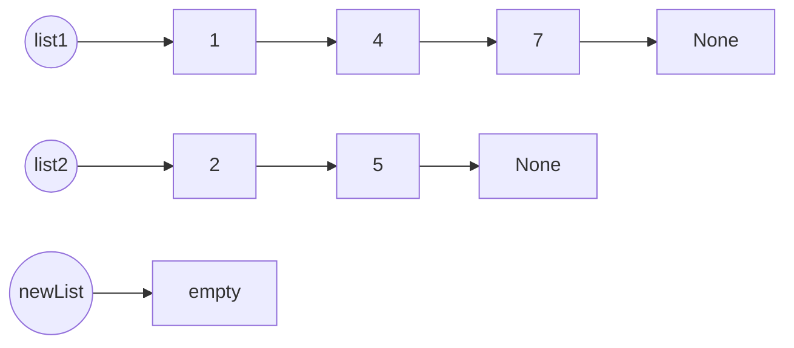
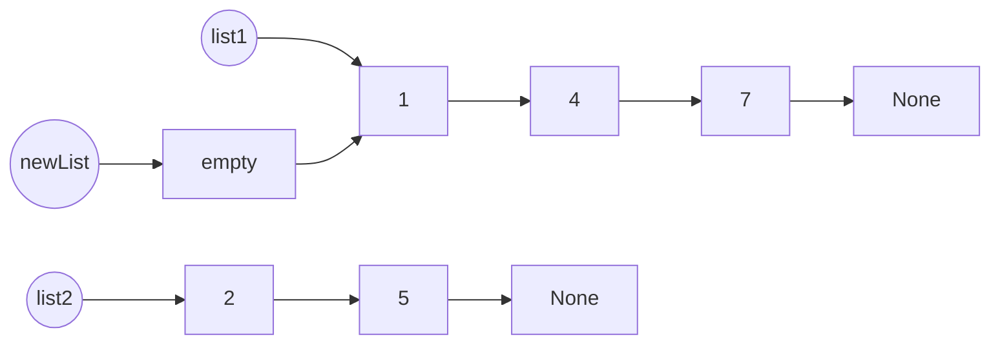
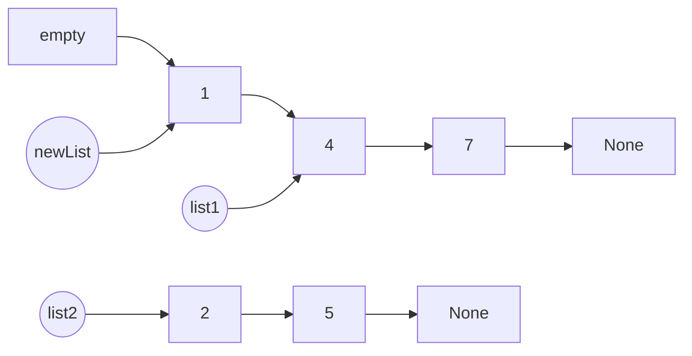
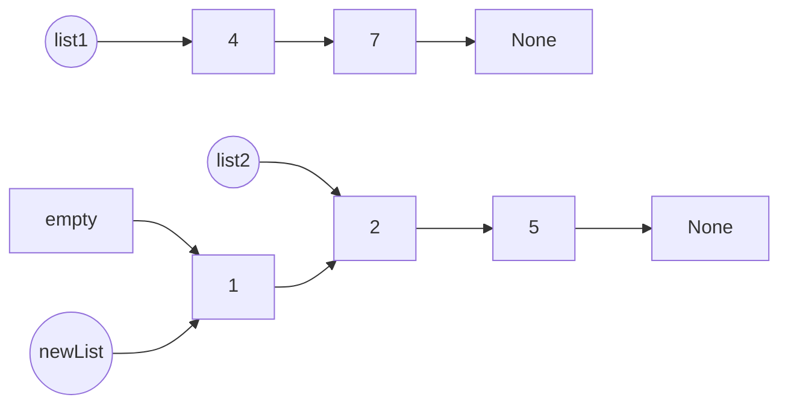
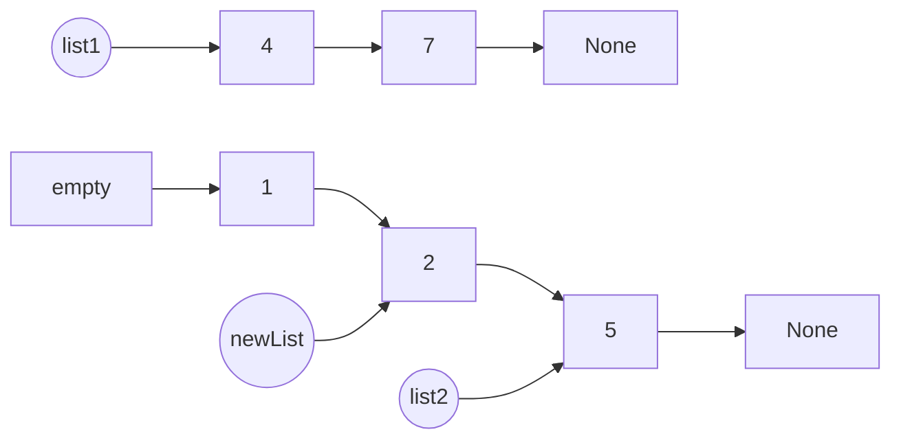
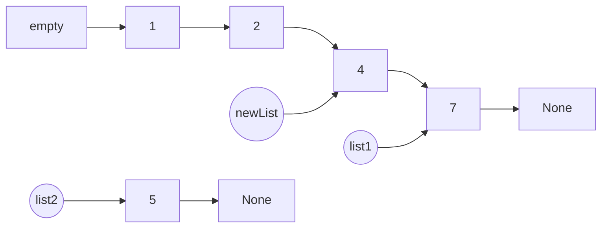
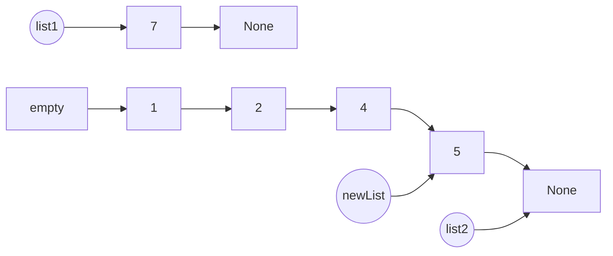
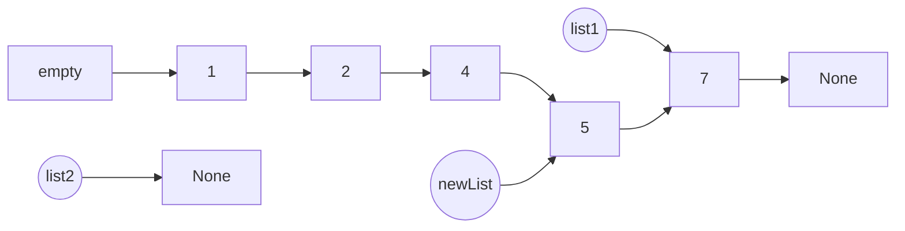

# LeetCode 23: Merge k Sorted Lists
[Problem statement on LeetCode](https://leetcode.com/problems/merge-k-sorted-lists/)

## Approach
The problem involves joining multiple linked lists into one huge linked list in ascending order. A solution we can use is a divide and conquer method to simplify the problem so that we can solve it one small part at a time. The approach involves merging 2 small linked lists at a time and joining them in ascending order. Once we are able to join 2 linked lists together, we would be able to eventually join all the linked lists given by the problem with multiple iterations.

### Part 1: Joining 2 Linked Lists

Here we have 2 linked lists as examples and we will try to merge their nodes together in ascending order.



The circular nodes represent pointers that are pointing to specific nodes in the linked lists. These pointers can change the next pointer of the nodes they reference.

Since we want to merge the linked lists in ascending order, we will have to pick the lower value when deciding which node to add to the <u>new linked list? (change to merged linked list or what)</u>. Between the two starting nodes, we have the values:

$$
\texttt{list1.val = 1} \qquad | \qquad \texttt{list2.val = 2}
$$
 
Since list1.val is smaller, it will be added to the new linked list first.



Then we update the list1 pointer to point to the next node in its own list.



Now we compare the values of list1.val and list2.val again.

$$
\texttt{list1.val = 4} \qquad | \qquad \texttt{list2.val = 2}
$$

Since list2.val is smaller, it will be pointed to next



Then we update the pointers again.



We keep repeating this process of checking for the smaller value of the nodes currently being pointed to by the two list pointers, joining the node with the smaller value to the new list, and updating the pointers to prepare for the next node addition to the new list.



We will keep adding nodes to the new list until one of the original linked lists run out of nodes with values.



Since list2 is now empty and pointing to None, we do not have anymore nodes to compare and we can just point to whatever node is left in list1 because the original linked lists are already sorted in ascending order.



The resulting linked list will be sorted in ascending order and is returned using empty.next.


We have successfully joined the two linked lists together and sorted them in ascending order of their values.

### Part 2: Joining a List of Linked Lists

Using the method of joining 2 linked lists together in Part 1, we can iterate through an array of linked lists, joining 2 at a time until we end up with 1 large linked list.

Here we have a list of 5 linked lists:

$$
\left[
\begin{array}{ccccc}
l_1, & l_2, & l_3, & l_4, & l_5 \\
\end{array}
\right]
$$

After iterating through the list once and joining 2 linked list using the method in part 1, the array of linked lists would look something like this:

$$
\left[
\begin{array}{ccc}
l_1\_l_2, & l_3\_l_4, & l_5 \\
\end{array}
\right] 
\text{$l_1\_l_2$ denotes $l_1$ merged with $l_2$}
$$

Iterating through the list for a second time will yield:

$$
\left[
\begin{array}{cc}
l_1\_l_2\_l_3\_l_4, & l_5 \\
\end{array}
\right] 
$$

A third and final iteration through the entire array produces the final linked list, with its nodes sorted in ascending order by using the method in part 1.

$$
\left[
\begin{array}{c}
l_1\_l_2\_l_3\_l_4\_l_5 \\
\end{array}
\right] 
$$

## Example 1:

## Example 2:

## Code
```python
def mergeKLists(self, lists):
    # divide and conquer: divide the problem into 2 lists from many 
    # lists to make it more manageable
    def merge(list1, list2):
        empty = ListNode()
        newList = empty

        while list1 and list2:
            if list1.val < list2.val:
                newList.next = list1
                list1 = list1.next
            else:
                newList.next = list2
                list2 = list2.next
            newList = newList.next
            
        if list1:
            newList.next = list1
        else:
            newList.next = list2
            
        return empty.next

    if not lists:
        return None
        
    while len(lists) > 1:
        newMerged = []

        for i in range(0, len(lists), 2):
            list1 = lists[i]
            list2 = lists[i + 1] if i + 1 < len(lists) else None

            # the above can also be written as:
            # if i + 1 < len(lists):
            #     list2 = lists[i + 1]
            # else:
            #     list2 = None

            newMerged.append(merge(list1, list2))

        lists = newMerged
        
    return lists[0]
```

## Possible Considerations

