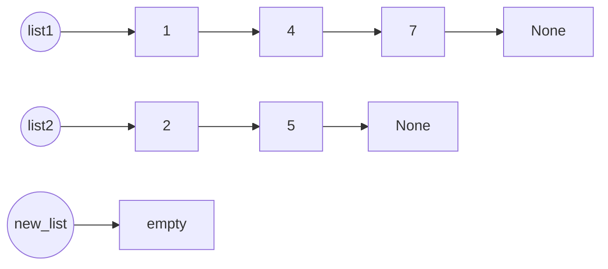
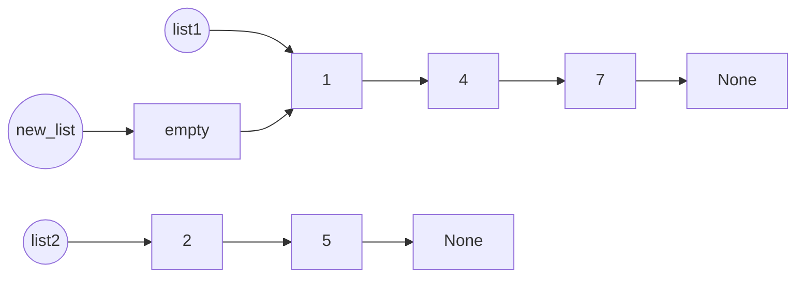
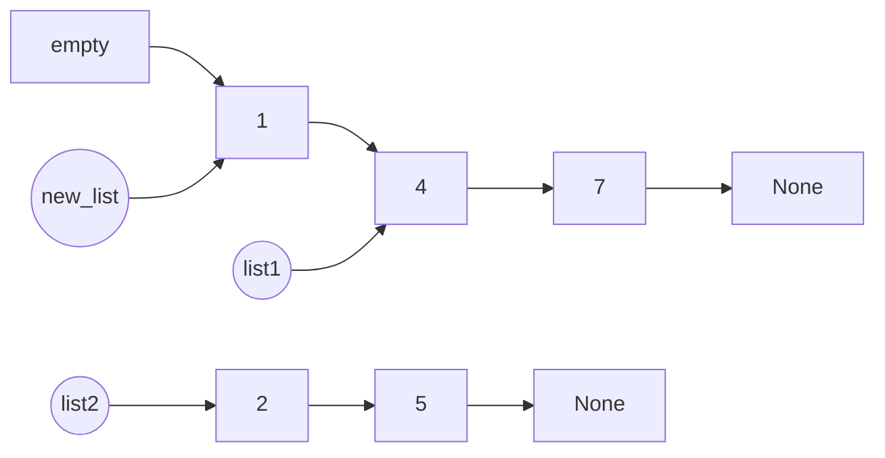
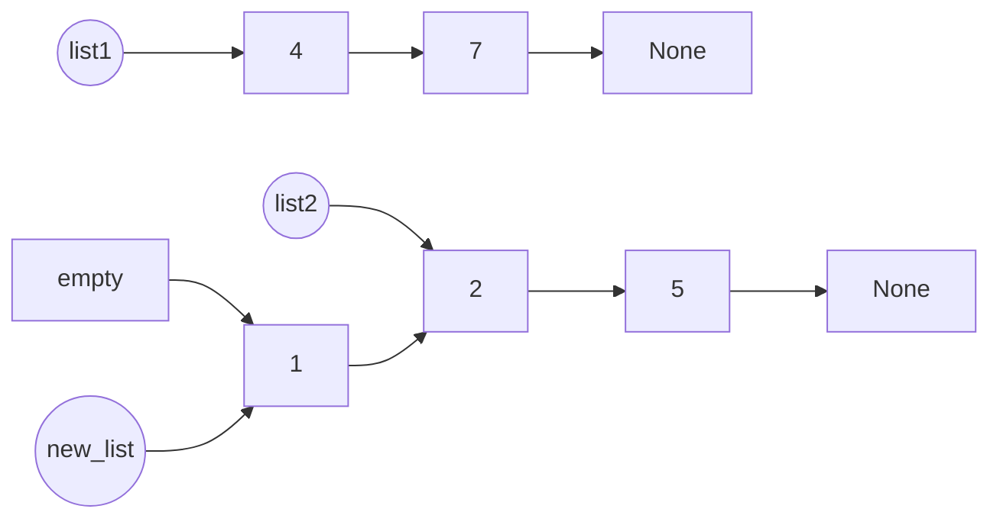
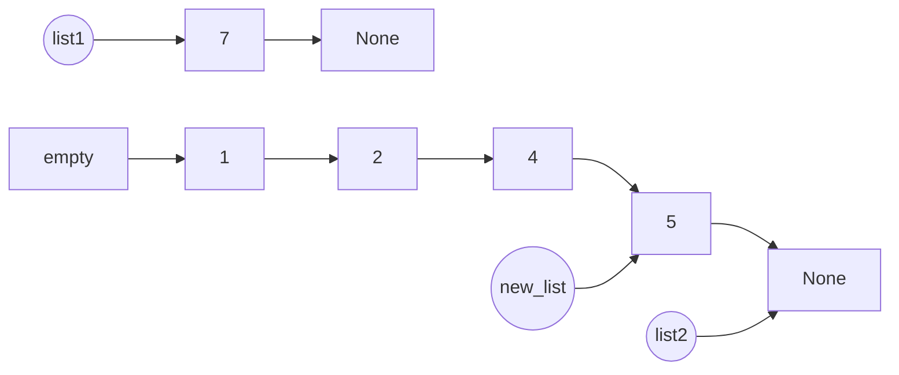
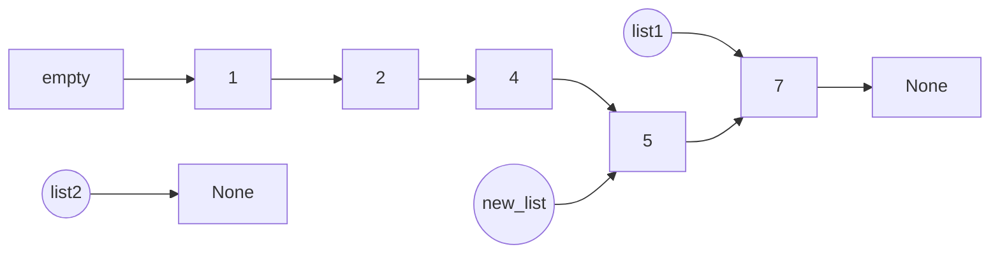

# LeetCode 23: Merge k Sorted Lists
[Problem statement on LeetCode](https://leetcode.com/problems/merge-k-sorted-lists/)

## Approach
The problem involves joining multiple linked lists into one huge linked list in ascending order. A solution we can use is a divide and conquer method to simplify the problem so that we can solve it one small part at a time. The approach involves merging 2 small linked lists at a time and joining them in ascending order. Once we are able to join 2 linked lists together, we would be able to eventually join all the linked lists given by the problem with multiple iterations.

### Part 1: Joining 2 Linked Lists

Here we have 2 linked lists as examples and we will try to merge their nodes together in ascending order.



The circular nodes represent pointers that are pointing to specific nodes in the linked lists. These pointers can change the next pointer of the nodes they reference.

Since we want to merge the linked lists in ascending order, we will have to pick the lower value when deciding which node to add to the <u>new linked list? (change to merged linked list or what)</u>. Between the two starting nodes, we have the values:

$$
\texttt{list1.val = 1} \qquad | \qquad \texttt{list2.val = 2}
$$
 
Since list1.val is smaller, it will be added to the new linked list first.



Then we update the list1 pointer to point to the next node in its own list.



Now we compare the current values of list1.val and list2.val again.

$$
\texttt{list1.val = 4} \qquad | \qquad \texttt{list2.val = 2}
$$

Since list2.val is smaller, it will be pointed to next



Then we update the pointers again.


We keep repeating this process of checking for the smaller value of the nodes currently being pointed to by the two list pointers, joining the node with the smaller value to the new list, and updating the pointers to prepare for the next node addition to the new list.


We will keep adding nodes to the new list until one of the original linked lists run out of nodes with values.



Since list2 is now empty and pointing to None, we do not have anymore nodes to compare and we can just point to whatever node is left in list1 because the original linked lists are already sorted in ascending order.



The resulting linked list will be sorted in ascending order and is returned using empty.next.


We have successfully joined the two linked lists together and sorted them in ascending order of their values.

### Part 2: Joining a List of Linked Lists

Using the method of joining 2 linked lists together in Part 1, we can iterate through an array of linked lists, joining 2 at a time until we end up with 1 large linked list.

Here we have a list of 5 linked lists:

$$
\LARGE\left[\space\begin{array}{ccccc}
l_1, & l_2, & l_3, & l_4, & l_5
\end{array}\space\right]
$$

After iterating through the list once and joining 2 linked list using the method in part 1, the array of linked lists would look something like this:

$$
\LARGE\left[\space\begin{array}{ccc}
l_{1}l_{2}, & l_{3}l_{4}, & l_5
\end{array}\space\right]
$$

$$
\text{$l_{1}l_{2}$ denotes $l_{1}$ merged with $l_{2}$}
$$

Iterating through the list for a second time will yield:

$$
\LARGE\left[\space\begin{array}{cc}
l_{1}l_{2}l_{3}l_{4}, & l_{5}
\end{array}\space\right]
$$

A third and final iteration through the entire array produces the final linked list, with its nodes sorted in ascending order by using the method in part 1.

$$
\LARGE\left[\space\begin{array}{c}
l_{1}l_{2}l_{3}l_{4}l_{5}
\end{array}\space\right]
$$

## Example 1:

Initial array of linked list:

$$
\large\begin{bmatrix}
\space\begin{bmatrix} \space 7, & 13, & 42 \space \end{bmatrix}, &
\begin{bmatrix} \space 99 \space \end{bmatrix}, &
\begin{bmatrix} \space 2, & 5, & 5, & 8 \space \end{bmatrix}, &
\begin{bmatrix} \space \end{bmatrix}, &
\begin{bmatrix} \space 3, & 12, & 65, & 77, & 91 \space \end{bmatrix}, &
\begin{bmatrix} \space 8, & 14 \space \end{bmatrix} \space
\end{bmatrix}
$$

After the first iteration and using the merge() function that was defined to merge 2 lists at a time, the initial array will be transformed into the following array: 

$$
\large\begin{bmatrix}
\space\begin{bmatrix} \space 7, & 13, & 42, & 99 \space \end{bmatrix}, &
\space\begin{bmatrix} \space 2, & 5, & 5, & 8 \space \end{bmatrix}, &
\space\begin{bmatrix} \space 3, & 8, & 12, & 14, & 65, & 77, & 91 \space \end{bmatrix} \space
\end{bmatrix}
$$

After the second iteration: 

$$
\large\begin{bmatrix}
\space\begin{bmatrix} \space 2, & 5, & 5, & 7, & 8, & 13, & 42, & 99 \space \end{bmatrix}, &
\space\begin{bmatrix} \space 3, & 8, & 12, & 14, & 65, & 77, & 91 \space \end{bmatrix} \space
\end{bmatrix}
$$

The final iteration will yield the complete merged linked list with all values sorted in ascending order. 

$$
\large\begin{bmatrix}
\space\begin{bmatrix} \space 2, & 3, & 5, & 5, & 7, & 8, & 8, & 12, & 13, & 14, & 42, & 65, & 77, & 91, & 99 \space \end{bmatrix} \space
\end{bmatrix}
$$

## Example 2:

Initial array of linked list:

$$
\large\begin{bmatrix}
\space\begin{bmatrix} \space 5, & 8, & 12, & 19 \space \end{bmatrix}, &
\begin{bmatrix} \space 3, & 7, & 14 \space \end{bmatrix}, &
\begin{bmatrix} \space 2, & 6, & 9, & 11, & 21 \space \end{bmatrix}, &
\begin{bmatrix} \space 4, & 18 \space \end{bmatrix}, &
\begin{bmatrix} \space 1, & 10, & 13, & 15, & 17, & 20 \space \end{bmatrix} \space
\end{bmatrix}
$$

After the first iteration using the merge() function:

$$
\large\begin{bmatrix}
\space\begin{bmatrix} \space 3, & 5, & 7, & 8, & 12, & 14, & 19 \space \end{bmatrix}, &
\begin{bmatrix} \space 2, & 4, & 6, & 9, & 11, & 18, & 21 \space \end{bmatrix}, &
\begin{bmatrix} \space 1, & 10, & 13, & 15, & 17, & 20 \space \end{bmatrix} \space
\end{bmatrix}
$$

After the second iteration we get:

$$
\large\begin{bmatrix}
\space\begin{bmatrix} \space 2, & 3, & 4, & 5, & 6, & 7, & 8, & 9, & 11, & 12, & 14, & 18, & 19, & 21 \space \end{bmatrix}, &
\begin{bmatrix} \space 1, & 10, & 13, & 15, & 17, & 20 \space \end{bmatrix} \space
\end{bmatrix}
$$

Notice how the last linked list in the array remains unchanged. In the first and second iteration, the index of the last linked list was odd. 

Considering the fact that the index of the first linked list in a pair will always be odd, if an odd index is found at the last element of the array, there will not be a second linked list to complete the merging pair. Thus, the last linked list in the array of this particular example was unchanged for 2 iterations before merging into the final linked list.

After the third iteration, we will get the final linked list sorted in ascending order for example number 2.

$$
\large\begin{bmatrix}
\space\begin{bmatrix} \space 1, & 2, & 3, & 4, & 5, & 6, & 7, & 8, & 9, & 10, & 11, & 12, & 13, & 14, & 15, & 17, & 18, & 19, & 20, & 21 \space \end{bmatrix} \space
\end{bmatrix}
$$

## Code
```python
def mergeKLists(self, lists):
    # divide and conquer: divide the problem and simplify it to solve for 2 lists at a time
    # once it is possible to successfully merge 2 lists together, 
    # it will be easier to solve the problem of merging multiple lists  
    def merge(list1, list2):
        empty = ListNode()
        new_list = empty

        while list1 and list2:
            if list1.val < list2.val:
                new_list.next = list1
                list1 = list1.next
            else:
                new_list.next = list2
                list2 = list2.next
            new_list = new_list.next
            
        if list1:
            new_list.next = list1
        else:
            new_list.next = list2
            
        return empty.next

    if not lists:
        return None
        
    while len(lists) > 1:
        new_merged = []

        for i in range(0, len(lists), 2):
            list1 = lists[i]
            list2 = lists[i + 1] if i + 1 < len(lists) else None

            # the above can also be written as:
            # if i + 1 < len(lists):
            #     list2 = lists[i + 1]
            # else:
            #     list2 = None

            new_merged.append(merge(list1, list2))

        lists = new_merged
        
    return lists[0]
```


