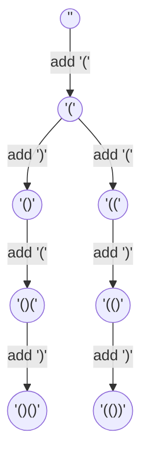
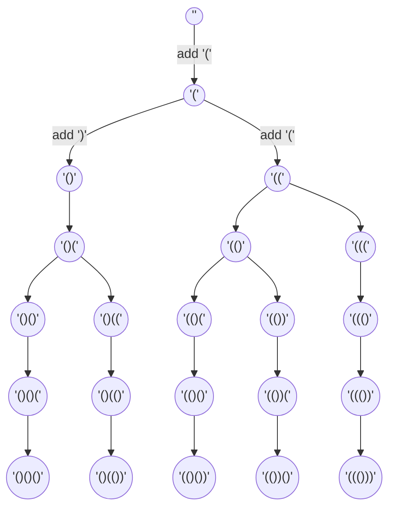

# LeetCode 22: Generate Parentheses
[Problem statement on LeetCode](https://leetcode.com/problems/generate-parentheses/)

## Approach
Given a number, `n`, we would need to generate all possible combinations of `n` parentheses pairs. Correct combinations follow the following rules:

1. Number of open parentheses must be equal to the number of closed parentheses.
2. Closed parenthesis cannot be added without a corresponding open parenthesis before it.
3. Number of open parentheses and closed parentheses cannot exceed `n`.

In order to obey the rules stated above, we need variables to keep track of each number of closed (`closedN`) and open (`openN`) parentheses. While building a valid combination, we can simplify the problem down to 2 decisions. Either we add an open parenthesis, `'('`, or a closed parenthesis, `')'`. We stop adding parentheses when the number of open (`openN`) and closed (`closedN`) parentheses are equal to `n`. These decisions can be further elaborated with the following points.

1. An open parenthesis, `'('`, can be added when `openN` is smaller than `n`.
2. A closed parenthesis, `')'`, can be added when `closedN` is smaller than `openN`.
3. Valid combination is found when `openN == closedN == n`.

### Backtracking
**Backtracking** is an algorithm that allows the program to try out different decisions to see if they work and undo the choice to try another decision until all possible decisions are considered. It allows us to visit each "*branch*" of decision until an end is reached and it rewinds back to the initial choice to take another "*branch*" and continue until all "*branches*" have been visited. Since we need to find **all possible combinations**, we would need to use backtracking to generate our solutions. 

A good analogy to understand the backtracking algorithm further would be to imagine a visiting a fork in a road and choosing to go down a path until the end and turning back to the same fork in the road to choose the other path. Backtracking can be thought of as visiting all paths in every fork of every road, rewinding as needed one after the other, leaving no path unchecked. ***Backtracking leaves no stones unturned***.

The **reason** we need backtracking to solve this problem is because we **wish to find all possible combinations** of the numerous pairs of parentheses. Since we already defined concrete rules earlier, we essentially created our own "*forks in the road*", which allows us to make decisions, determine when we reach an end just like how a "*road*" has reached the end, and undo our choices to go back to a previous "*fork in the road*".

## Example 1:
Given `n = 2`



## Example 2:
Given `n = 3`



## Code
```python
def generateParenthesis(n):
    stack = []
    res = []

    def backtrack(openN, closedN):
        if openN < n:
            stack.append('(')
            backtrack(openN + 1, closedN)
            stack.pop()
        if closedN < openN:
            stack.append(')')
            backtrack(openN, closedN + 1)
            stack.pop()
        if n == closedN == openN:
            res.append("".join(stack))

    backtrack(0, 0)
    return res
```