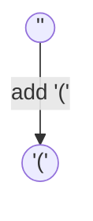
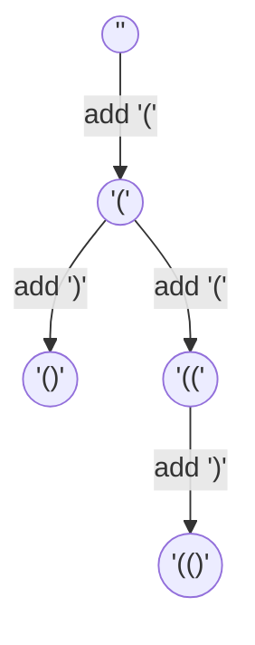
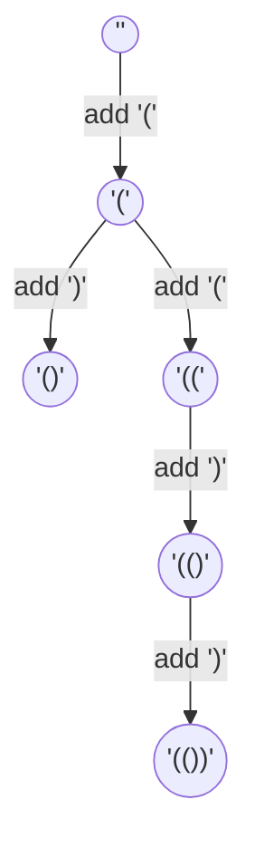
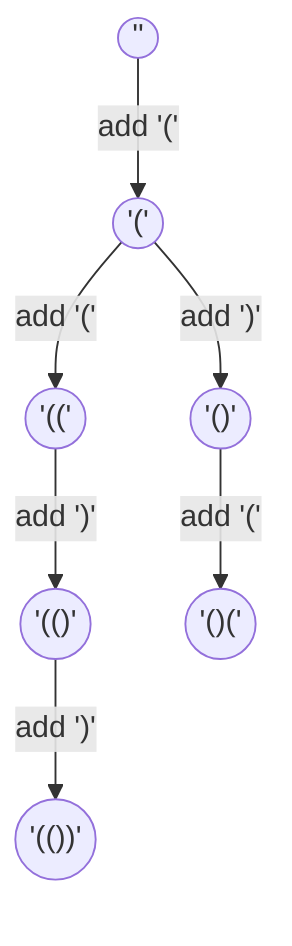
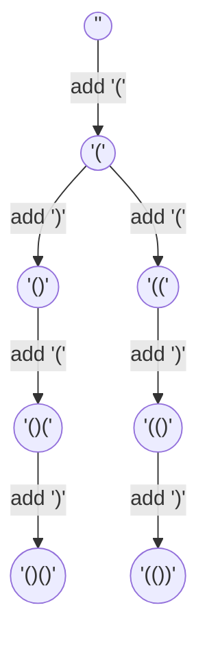
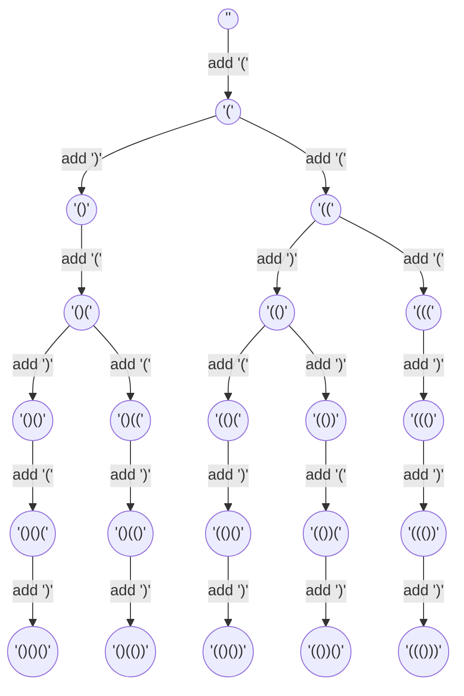

# LeetCode 22: Generate Parentheses
[Problem statement on LeetCode](https://leetcode.com/problems/generate-parentheses/)

## Approach
Given a number, `n`, we would need to generate all possible combinations of `n` parentheses pairs. Correct combinations follow the following rules:

1. Number of open parentheses must be equal to the number of closed parentheses.
2. Closed parenthesis cannot be added without a corresponding open parenthesis before it.
3. Number of open parentheses and closed parentheses cannot exceed `n`.

In order to obey the rules stated above, we need variables to keep track of each number of closed (`closedN`) and open (`openN`) parentheses. While building a valid combination, we can simplify the problem down to 2 decisions. Either we add an open parenthesis, `'('`, or a closed parenthesis, `')'`. We stop adding parentheses when the number of open (`openN`) and closed (`closedN`) parentheses are equal to `n`. These decisions can be clarified with the following points.

1. An open parenthesis, `'('`, can be added when `openN` is smaller than `n`.
2. A closed parenthesis, `')'`, can be added when `closedN` is smaller than `openN`.
3. Valid combination is found when `openN == closedN == n`.

### Backtracking
**Backtracking** is an algorithm that allows the program to try out different decisions to see if they work and undo the choice to try another decision until all possible decisions are considered. It allows us to visit each "*branch*" of decision until an end is reached and it rewinds back to the initial choice to take another "*branch*" and continue until all "*branches*" have been visited. Since we need to find **all possible combinations**, we would need to use backtracking to generate our solutions. 

A good analogy to understand the backtracking algorithm further would be to imagine a visiting a fork in a road and choosing to go down a path until the end and turning back to the same fork in the road to choose the other path. Backtracking can be thought of as visiting all paths in every fork of every road, rewinding as needed one after the other, leaving no path unchecked. ***Backtracking leaves no stones unturned***.

The **reason** we need backtracking to solve this problem is because we **wish to find all possible combinations** of the numerous pairs of parentheses. Since we already defined concrete rules earlier, we essentially created our own "*forks in the road*", which allows us to make decisions, determine when we reach an end just like how a "*road*" has reached the end, and undo our choices to go back to a previous "*fork in the road*".

### Data structure
A **stack** data structure will be used to keep track of the valid combination of parentheses as we build our combinations. Since we would need to remove additions of parentheses when we backtrack to an earlier "fork", we can just pop from the stack as it removes the latest addition. To backtrack to an earlier "fork" the algorithm continues popping from the stack, constantly checking at every pop if another path can be taken. 


## Example 1:
Given `n = 2`, below we have the entire decision tree for all possible combinations for `2 pairs` of parentheses. The maximum number of open parentheses is 2, and the maximum number of closed parentheses is 2.

We start with an empty string and build the empty string up to valid combinations of parentheses. Since we cannot start with a closed parentheses, the only possible choice here is to add an open parentheses. 



Now we have the option to add either an open or a closed parenthesis. Since we have 2 different options to choose from, we have reached a "fork". We can choose to go down one of the paths, and mark the other choice to return to at a later stage. 



In this example, we chose to continue down the path that added another open parenthesis. Since the number of open parentheses have reached the maximum for this example, the only choice available here is to add a closed parentheses and continue adding until we reach the maximum number of closed parentheses allowed.



A valid combination of parentheses is obtained, which will be appended into an array that contains all possible valid combinations of parentheses. 

No more parentheses can be added in the string anymore, which means we need to backtrack to a previous "fork", checking at each node if there are any unvisited decision paths. As we go up the tree, we pop from the stack that holds the current combination of parentheses.


There is an unvisited decision path at level 2 of the tree, where a closing parenthesis could be added instead of the open parenthesis we added earlier. 

After adding the closing parenthesis, the only choice available would be to add an open parenthesis. This is because a closed parenthesis can only be added if there is an open parenthesis without a corresponding closed parenthesis.



The number of open parentheses used have reached the maximum, which leaves a single closed parenthesis left to add to the combination.



Another valid combination of parentheses is obtained, which will be appended into the array that contains all possible valid combinations of parentheses. Since there are no more unvisited decision branches/paths, the result array containing all the valid parentheses combinations is returned. In this case, the array is `['(())', '()()']`.

## Example 2:
Given `n = 3`, below we have the entire decision tree for all possible combinations for `3 pairs` of parentheses.



 - in this example, we see a total of 4 forks in the whole decision tree
 - similar to example 1, at the first fork, the backtracking algorithm picks one of the paths to go down, say the left one, and continues until it reaches another fork or the end
 - in the left path, the algorithm encounters another fork at level 4 of the decision tree
 - lets say it goes down the left path again. in this path, there are no more forks and therefore it reaches the end and we get a valid combination of parentheses. 
 - everytime the algorithm reaches the end in one branch, it will backtrack to the latest fork in the road, which will be the one at level 4 and not the one at level 2. 
 - since we went down the left path already, that leaves the right path as the only choice
 - the same thing happens and we reach the end of the branch and we backtrack to the latest fork. since the fork at level 4 has all of its options visited, we will visit one fork up at level 2
 - visiting the right branch of the fork at level 2 this time, we immediately meet another fork
 - assuming we take the left branch, we meet another fork and continue taking the left branch again
 - and this continues until the end and we backtrack to the latest branch and take the other path
 - this pattern continues until all branches are visited fully

## Code
```python
def generateParenthesis(n):
    stack = []
    res = []

    def backtrack(openN, closedN):
        if openN < n:
            stack.append('(')
            backtrack(openN + 1, closedN)
            stack.pop()
        if closedN < openN:
            stack.append(')')
            backtrack(openN, closedN + 1)
            stack.pop()
        if n == closedN == openN:
            res.append("".join(stack))

    backtrack(0, 0)
    return res
```